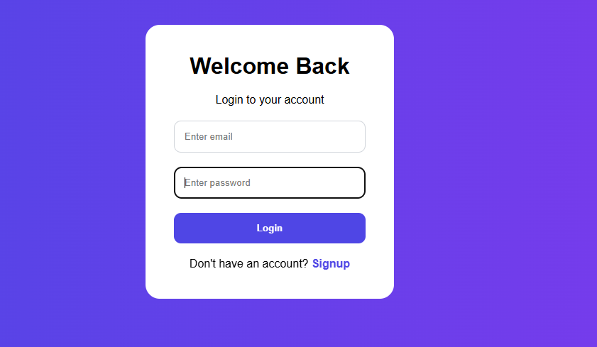
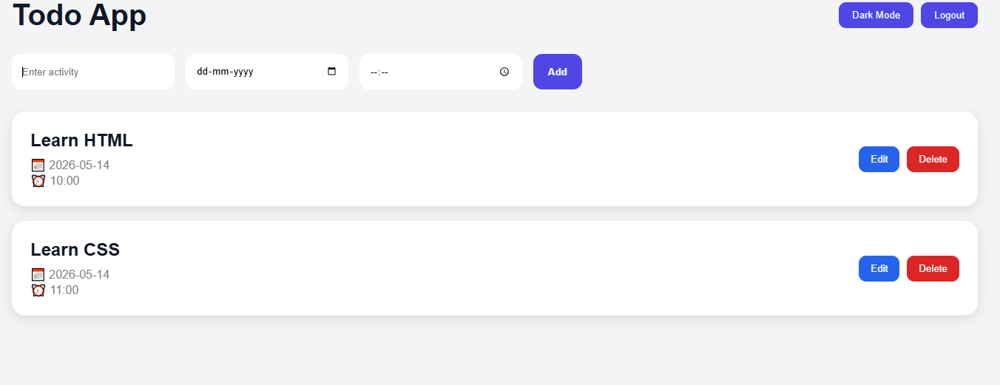

# Full Stack Todo App

A modern full stack Todo Application built using React, Node.js, Express, and MongoDB.

---

# Features

- User Authentication (Signup/Login)
- JWT Authentication
- Add Activities
- Edit Activities
- Delete Activities
- User-specific Todos
- Dark / Light Mode
- Responsive UI
- Date & Time Support
- MongoDB Database
- REST API Integration
- Loading States
- Error Handling

---

# Tech Stack

## Frontend
- React
- Axios
- CSS

## Backend
- Node.js
- Express.js

## Database
- MongoDB Atlas

## Authentication
- JWT
- bcryptjs

---

# Project Structure

```text
todo-app/
│
├── backend/
│   ├── middleware/
│   ├── models/
│   ├── routes/
│   ├── .env
│   ├── server.js
│   └── package.json
│
├── frontend/
│   ├── src/
│   │   ├── App.jsx
│   │   ├── index.css
│   │   └── main.jsx
│   └── package.json
│
└── README.md

-----
Authentication Flow:
   =>User signs up
   =>User logs in
   =>JWT token stored in localStorage
   =>Token sent with API requests
   =>Backend verifies token
   =>User accesses personal todos

-----
Screenshots

  1.Login page:  
  2.Dashboard:  